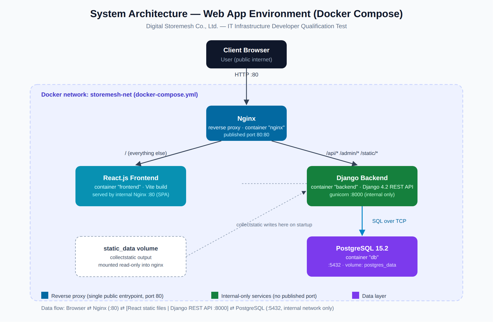

# Storemesh IT Infrastructure — Qualification Test

Dockerized web application environment: **PostgreSQL 15.2 + Django 4.2 + React.js + Nginx**, built for the *IT Infrastructure Developer* qualification test at Digital Storemesh Co., Ltd.

The sample app is a minimal **To-do list**: a Django REST API backed by PostgreSQL, and a React single-page app that reads/writes todos through the API. The functionality is intentionally simple — the point of this test is the *infrastructure* (containers, networking, reverse proxy, config), not the app logic.

## Architecture



```
Client Browser
      │  HTTP :80
      ▼
   ┌────────┐   /              ┌──────────────────┐
   │  Nginx │──────────────────▶  React frontend   │
   │ proxy  │                  │  (static build)   │
   │  :80   │   /api /admin    └──────────────────┘
   │        │───────────────┐
   └────────┘               ▼
                    ┌──────────────────┐      SQL/TCP :5432     ┌──────────────┐
                    │  Django backend  │────────────────────────▶ PostgreSQL   │
                    │  gunicorn :8000  │                        │    15.2      │
                    └──────────────────┘                        └──────────────┘
```

Nginx is the **only** container with a port published to the host (`80:80`). Everything else — `backend`, `frontend`, `db` — talks over the internal Docker network `storemesh-net` and is not directly reachable from outside. Nginx routes by path:

| Path | Routed to | Purpose |
|---|---|---|
| `/api/*` | `backend:8000` | Django REST API (todos CRUD, health check) |
| `/admin/*` | `backend:8000` | Django admin site |
| `/static/*` | `static_data` volume | Django-collected static files (admin CSS/JS), served directly by Nginx |
| everything else | `frontend:80` | React SPA (built with Vite, served by its own internal Nginx) |

Django talks to PostgreSQL over the internal network only (`db:5432`); the browser and the outer Nginx never see the database directly.

## Repository layout

```
.
├── backend/                 # Django 4.2 project (REST API)
│   ├── config/               # settings.py, urls.py, wsgi.py
│   ├── todos/                 # sample app: Todo model + CRUD API + /health
│   ├── Dockerfile
│   ├── entrypoint.sh          # waits for DB, runs migrate + collectstatic
│   └── requirements.txt
├── frontend/                 # React.js app (Vite)
│   ├── src/                   # To-do UI, calls /api/todos
│   ├── Dockerfile             # multi-stage: node build -> nginx serve
│   └── nginx.frontend.conf    # serves the built SPA
├── nginx/
│   └── nginx.conf             # reverse proxy: routes / , /api, /admin, /static
├── docs/
│   ├── architecture.svg / .png
├── docker-compose.yml         # postgres + backend + frontend + nginx
└── .env.example                # copy to .env before running
```

## How to build and run

**Requirements:** Docker Engine + Docker Compose plugin (`docker compose version`).

```bash
git clone <this-repo-url>
cd storemesh-it-infra

# 1. Configure environment variables
cp .env.example .env
# edit .env and set a real POSTGRES_PASSWORD / DJANGO_SECRET_KEY

# 2. Build and start everything
docker compose up --build -d

# 3. Check that all 4 containers are healthy
docker compose ps

# 4. Open the app
#    Frontend (To-do UI):   http://localhost/
#    API root:               http://localhost/api/todos/
#    Health check:            http://localhost/api/health/
#    Django admin:            http://localhost/admin/
```

To create a Django admin user:

```bash
docker compose exec backend python manage.py createsuperuser
```

To follow logs for a single service (e.g. while debugging Nginx routing):

```bash
docker compose logs -f nginx
docker compose logs -f backend
```

To stop everything (and remove containers, keep data volumes):

```bash
docker compose down
```

To stop **and** wipe the database volume (fresh start):

```bash
docker compose down -v
```

### What happens on startup

1. `db` starts and Compose waits for its healthcheck (`pg_isready`) before starting `backend`.
2. `backend`'s `entrypoint.sh` waits for PostgreSQL's TCP port, runs `python manage.py migrate`, then `collectstatic` (output goes into the shared `static_data` volume), then starts `gunicorn`.
3. `frontend` builds the React app with Vite (`npm run build`) in a Node stage, then copies the static output into a small `nginx:alpine` image.
4. `nginx` (the reverse proxy) starts last and routes traffic to `backend`/`frontend` by path, using Docker's embedded DNS so it doesn't need either service to already be resolvable at its own startup.

## Explanation of the system architecture

**Why a separate reverse-proxy Nginx in front of the frontend's own Nginx?** The `frontend` container's internal Nginx only knows how to serve static files and handle SPA routing (`try_files ... /index.html`). The outer `nginx` service is the single public entrypoint and is responsible for a different concern — deciding, per request, whether traffic belongs to the API or the SPA — and for terminating everything on one port (80) so the browser never needs to know that `backend` and `frontend` are separate containers.

**Why PostgreSQL isn't exposed to Nginx or the frontend.** Only `backend` has `DATABASES` configured; `db`'s port `5432` is published to the *host* (for local `psql`/DB-GUI debugging) but not routed through Nginx, and no other container needs it. This keeps the data layer reachable only from the one service that's supposed to touch it.

**Why environment variables, not hardcoded config.** `docker-compose.yml` injects `POSTGRES_*` and `DJANGO_*` values from `.env` into the `backend` and `db` services. The same backend Docker image can therefore run against a different database or with different secrets in another environment (e.g. staging) without rebuilding the image — only the `.env` file changes.

**Why a shared `static_data` volume.** Django's `collectstatic` needs to put admin/DRF static assets somewhere Nginx can serve them directly (faster and more standard than proxying static files through gunicorn). Both `backend` (writer, via `entrypoint.sh`) and `nginx` (reader) mount the same named volume `static_data` at `/app/staticfiles`.

**Why `resolver` + variables instead of a static `upstream {}` block in nginx.conf.** A static `upstream` block resolves the hostname once, when Nginx starts — if `nginx` happens to start before `backend`/`frontend` are ready, Nginx would fail to boot ("host not found in upstream"). Using Docker's embedded DNS resolver (`127.0.0.11`) together with a variable in `proxy_pass` makes Nginx resolve those hostnames lazily on each request, which is more resilient to service startup order and to a container restarting with a new IP.

## Evaluation checklist (from the assignment)

- [x] System architecture diagram (`docs/architecture.svg` / `.png`)
- [x] `docker-compose.yml` — PostgreSQL 15.2, Django 4.2, React.js, Nginx
- [x] `backend/Dockerfile` for the Django service
- [x] `nginx/nginx.conf` — routing rules for backend/frontend
- [x] `README.md` — build/run instructions + architecture explanation
